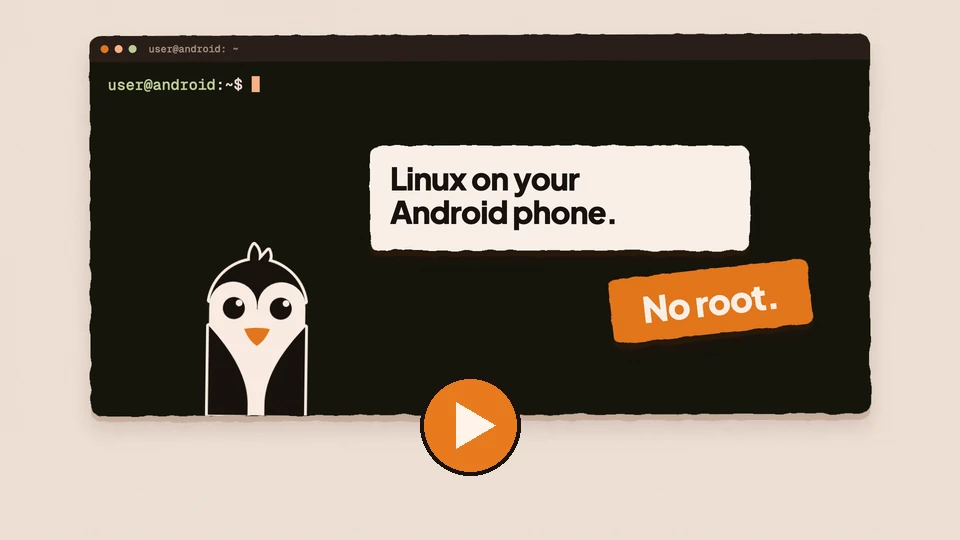
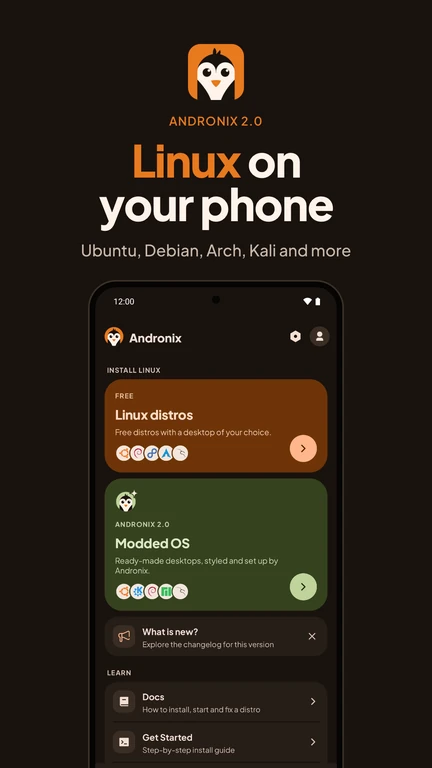
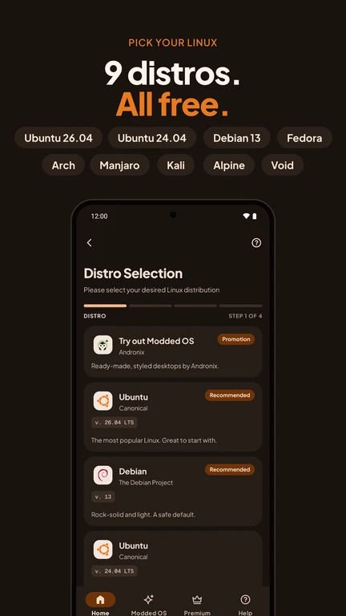
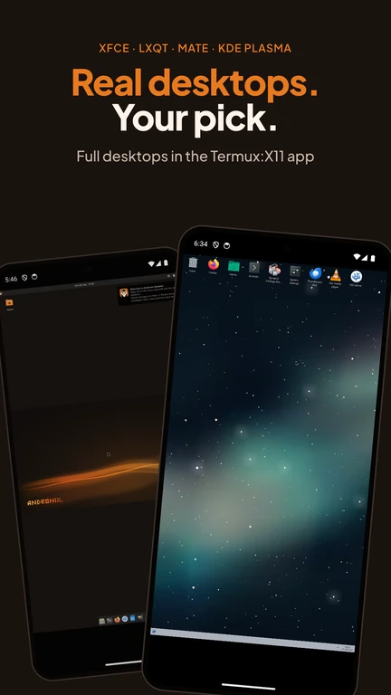
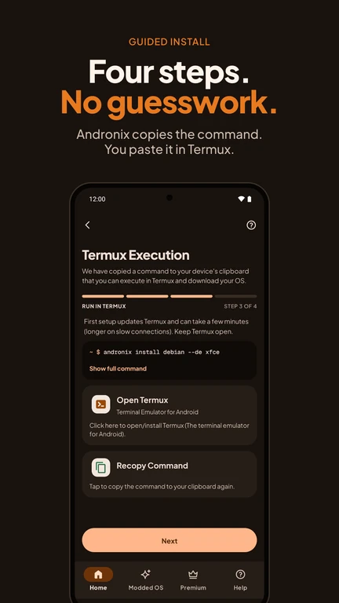
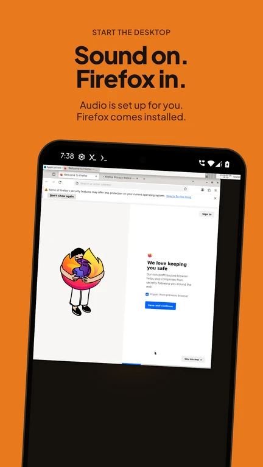
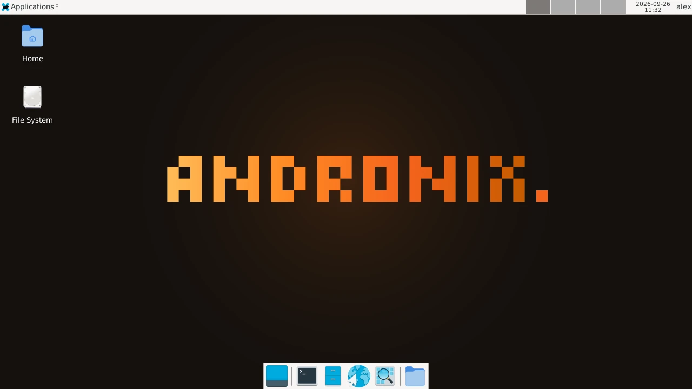
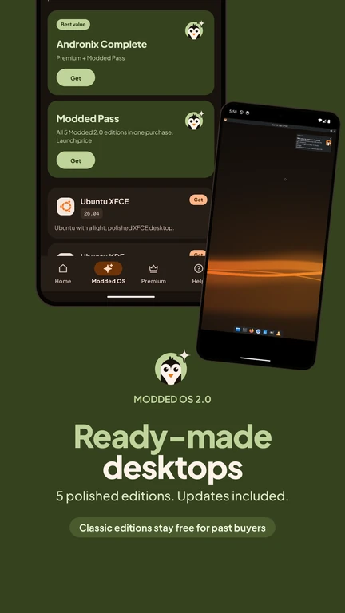
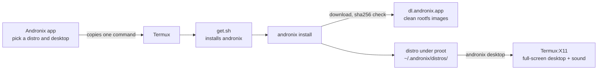

<p align="center">
  <a href="https://andronix.app">
    <picture>
      <source media="(prefers-color-scheme: dark)" srcset=".github/assets/hero-dark.webp">
      <source media="(prefers-color-scheme: light)" srcset=".github/assets/hero-light.webp">
      
    </picture>
  </a>
</p>

<p align="center">
  <b>Run Ubuntu, Debian, Kali, Fedora, Arch and more on your Android phone, with a full desktop. No root.</b>
</p>

<p align="center">
  <a href="https://play.google.com/store/apps/details?id=studio.com.techriz.andronix&utm_source=github&utm_medium=readme"></a>
  <a href="https://docs.andronix.app"></a>
  <a href="https://chat.andronix.app"></a>
  <br>
  <a href="https://github.com/AndronixApp/andronix/releases/latest"></a>
  <a href="LICENSE"></a>
  <a href="https://github.com/AndronixApp/AndronixOrigin"></a>
</p>

<p align="center">
  <a href="#quick-start">Quick start</a> ·
  <a href="#supported-distros">Distros</a> ·
  <a href="#desktops">Desktops</a> ·
  <a href="#modded-os-20">Modded OS 2.0</a> ·
  <a href="#how-it-works">How it works</a> ·
  <a href="#help-and-troubleshooting">Help</a> ·
  <a href="#using-app-8x-or-older">App 8.x</a>
</p>

---

## What is Andronix?

Andronix puts a real Linux distro on your Android phone or tablet. You get the distro's own command line and packages, and a desktop (XFCE, LXQt, MATE or KDE Plasma) that opens full screen on the phone. It doesn't need root and doesn't change anything on Android itself.

It runs inside [Termux](https://termux.dev) with [PRoot](https://proot-me.github.io), which lets the distro use its own root filesystem without root on the phone. The [Andronix app](https://play.google.com/store/apps/details?id=studio.com.techriz.andronix) picks the distro and desktop and gives you one command to paste into Termux. The `andronix` installer in this repository does the rest.

<p align="center">
  <a href="https://youtu.be/TxVvNbqHk8U"></a>
  <br>
  <sub><a href="https://youtu.be/TxVvNbqHk8U">Watch the Andronix 2.0 video on YouTube</a></sub>
</p>

## What's new in Andronix 2.0

Andronix 2.0 is app 10 plus a new installer, written in Go.

- **A new installer.** One Go binary that checks your phone, applies the fixes it needs, and verifies every download against its sha256. If an install stops, run the same command again and it continues.
- **9 free, current distros.** Ubuntu 26.04 LTS and 24.04 LTS, Debian 13, Kali, Fedora 44, Arch Linux ARM, Manjaro ARM, Alpine 3.24 and Void.
- **Desktops in Termux:X11.** `andronix desktop` opens your desktop full screen on the phone, with sound. VNC still works.
- **Firefox with video and sound**, and a normal user account with sudo instead of root.
- **Modded OS 2.0.** Five ready-made desktops, styled and set up by Andronix. One Modded Pass unlocks every edition.
- **A redesigned app.** Get notified when an install finishes, report a problem right from the app, and use it in 7 languages.

Full notes: [the Andronix 2.0 announcement](https://docs.andronix.app/blog/andronix-2-0) and the [installer changelog](CHANGELOG.md).

<p align="center">
  
  
  
  
  
  
</p>

## Quick start

**1. Install Termux.** From [F-Droid](https://f-droid.org/packages/com.termux/), [GitHub](https://github.com/termux/termux-app/releases) or Google Play (the Play build needs Android 11 or newer). See [Install Termux](https://docs.andronix.app/start-here/install-termux).

**2. Install a distro**, with the app or with one command.

- **With the app (recommended):** get [Andronix on Google Play](https://play.google.com/store/apps/details?id=studio.com.techriz.andronix&utm_source=github&utm_medium=readme), pick a distro and a desktop, and paste the command it copies into Termux. [Step-by-step guide](https://docs.andronix.app/install/with-the-app).
- **Without the app:** paste this into Termux, with the distro and desktop you want:

  ```sh
  curl -fsSL https://dl.andronix.app/get.sh -o $PREFIX/tmp/get.sh && sh $PREFIX/tmp/get.sh install debian --de xfce
  ```

  It sets up the `andronix` command and runs the install. The docs have [a version that retries on a bad connection](https://docs.andronix.app/install/without-the-app).

**3. Create your user** when the installer asks, then **open the desktop**: install the [Termux:X11 app](https://github.com/termux/termux-x11/releases/tag/nightly) (`termux-x11-universal-debug.apk`) and run this in Termux:

```sh
andronix desktop debian
```

Not sure what to pick? Debian 13 with XFCE runs on every phone. See [Choose a distro and desktop](https://docs.andronix.app/install/choose).

## Supported distros

All free. `andronix install <id> --de <desktop>` installs one.

| | Distro | Version | `id` | CPUs |
|:-:|---|---|---|---|
|  | Debian | 13 | `debian` | arm64, arm, x86, x86_64 |
|  | Ubuntu | 26.04 LTS | `ubuntu` | arm64, arm, x86_64 |
|  | Ubuntu | 24.04 LTS | `ubuntu24` | arm64, arm, x86_64 |
|  | Kali Linux | rolling | `kali` | arm64, arm, x86, x86_64 |
|  | Fedora | 44 | `fedora` | arm64, x86_64 |
|  | Arch Linux ARM | rolling | `arch` | arm64, arm, x86_64 |
|  | Manjaro ARM | stable | `manjaro` | arm64, x86_64 |
|  | Alpine | 3.24 | `alpine` | arm64, arm, x86, x86_64 |
|  | Void Linux | rolling | `void` | arm64, arm, x86, x86_64 |

Most phones are arm64. The installer checks your CPU first and tells you if a distro doesn't support it. Details, start scripts and package managers: [Supported distros](https://docs.andronix.app/reference/distros).

## Desktops

| Desktop | `--de` | Available on |
|---|---|---|
| **XFCE** (recommended) | `xfce` | every distro |
| **LXQt** | `lxqt` | every distro |
| **MATE** | `mate` | every distro |
| **KDE Plasma** | `kde` | Debian, Ubuntu 26.04 and Kali; needs 4 GB of RAM |
| Command line only | `none` | every distro |

Every desktop install comes with Firefox. Open it full screen with `andronix desktop` and the [Termux:X11 app](https://docs.andronix.app/desktop/termux-x11); sound plays through the phone's speakers. To use the desktop from another device, [VNC](https://docs.andronix.app/reference/vnc) works too.

<p align="center">
  
  <br>
  <sub>Debian 13 with XFCE, installed by <code>andronix</code></sub>
</p>

## Modded OS 2.0



Modded OS are Linux distros we've styled and set up for you: one Andronix look, themes, and the everyday apps already installed, so you can skip the setup. Modded 2.0 is built on the same current distros as the free installer:

- Ubuntu XFCE 26.04 LTS
- Ubuntu KDE 26.04 LTS
- Debian XFCE 13
- Manjaro XFCE ARM
- Kali Linux XFCE rolling

They're paid, and sold in the app through Google Play: the **Modded Pass** unlocks every edition, and **Andronix Complete** is Premium plus the Modded Pass. Prices are shown in the app. If you bought a Modded edition before 2.0, you keep it: it's in the app as a Classic edition.

The Modded images aren't in this repository; it has only the installer's side (`--edition`, `editions.conf`). See [Modded OS](https://docs.andronix.app/modded-os/modded-os) and [Installing Modded OS](https://docs.andronix.app/modded-os/modded-os-installation).

<br clear="right">

## Requirements

| | Command line only | With a desktop |
|---|---|---|
| **Android** | 7 or newer | 7 or newer |
| **Free storage** | about 0.5 GB | 1.5 to 2 GB (about 3 GB for KDE Plasma) |
| **RAM** | 2 GB | 3 GB or more is comfortable; 4 GB or more for KDE Plasma |
| **Root** | not needed | not needed |

- **Termux** from F-Droid, GitHub or Google Play. The Play build needs Android 11 or newer.
- **Android 12 and newer** can stop long-running apps (`Process completed (signal 9)`). [Turn that off once](https://docs.andronix.app/troubleshooting/signal-9).
- **Kernels older than 4.8** (many Android 8 and 9 phones): the command line works, but desktops stay black. The installer tells you.

More: [Requirements](https://docs.andronix.app/start-here/requirements) and [Limitations](https://docs.andronix.app/reference/limitations) (no Snap, Flatpak, Docker or GPU acceleration).

## How it works



- **The installer:** one Go binary per CPU (aarch64, arm, i686, x86_64), built with `GOOS=android` for Termux. A static Linux build of the same code runs inside each distro for the desktop and user setup.
- **Distros and desktops are data:** `distros/*.conf` and `desktops/*.conf` (plain `KEY=value`). The dev packs are data too, in `mods/packs/*.conf`.
- **Where the rootfs comes from:** clean tarballs on dl.andronix.app (`ci/build-rootfs.sh`, checked by `ci/check-image.sh`). If a tarball isn't there, the distro's official Docker image is used.
- **Running it:** each distro runs under proot, with fixes for Android kernels and seccomp. The installer measures what your phone's kernel and Termux can do and applies the fixes that phone needs; `andronix doctor` shows them.

[DESIGN.md](DESIGN.md) has the details, and [CHANGELOG.md](CHANGELOG.md) has the releases.

## Commands

```
andronix install <distro> [--de xfce|lxqt|mate|kde|none]
andronix start <distro> [-- command...]      ./start-<distro>.sh works too
andronix desktop <distro>                    the desktop in Termux:X11
andronix update [<distro>]                   the installer and your distros
andronix backup <distro> --to storage        andronix restore
andronix pack add <distro> python|node|java|go|db
andronix tune <distro> --profile light|balanced
andronix doctor                              what your phone supports, and the fixes applied
andronix report                              send us a problem report
andronix remove <distro>
andronix telemetry off|on|status
```

`andronix help` lists everything. Full reference: [the andronix command](https://docs.andronix.app/reference/andronix-command).

## Help and troubleshooting

- [The install fails or stops](https://docs.andronix.app/troubleshooting/install)
- [The desktop is black, slow or closes](https://docs.andronix.app/troubleshooting/desktop)
- [Process completed (signal 9)](https://docs.andronix.app/troubleshooting/signal-9)
- [Termux problems](https://docs.andronix.app/troubleshooting/termux)
- [FAQ](https://docs.andronix.app/troubleshooting/faq)
- [Report a problem](https://docs.andronix.app/troubleshooting/report-a-problem): from the app, or with `andronix report` in Termux

Still stuck? Ask on [Discord](https://chat.andronix.app) or email support@andronix.app.

## Using app 8.x or older?

Nothing changes for you. The app 8.x installers, uninstallers and scripts stay on the [`master` branch](https://github.com/AndronixApp/AndronixOrigin/tree/master), and the app keeps downloading them from there.

- [Docs for app 8.x (Classic)](https://docs.andronix.app/v8)
- [Installs from before Andronix 2.0](https://docs.andronix.app/pre-2.0/older-installs): what happens to them, and how to move to the new versions
- [Old install guides](https://docs.andronix.app/pre-2.0/old-install-guides) (VNC, sound and storage on an old install)

To get Andronix 2.0, update the app from [Google Play](https://play.google.com/store/apps/details?id=studio.com.techriz.andronix&utm_source=github&utm_medium=readme).

## Build and test

```sh
ci/build-go.sh                    # all binaries into dist/ (arm, i686 and x86_64 need the Android NDK or Docker)
NO_NDK=1 ci/build-go.sh           # quick: linux builds + android aarch64
go test ./...
tests/smoke.sh                    # end to end in a Termux-like Docker box (tests/Dockerfile)
tests/screens.sh debian xfce      # install a desktop and take screenshots
ci/build-rootfs.sh debian aarch64 # a clean rootfs tarball
```

The test box turns telemetry off (`ANDRONIX_NO_TELEMETRY=1`). `tests/emulator/` runs the installer inside the real Termux app on Android emulators.

## Contributing

- **Bugs:** [report a problem](https://docs.andronix.app/troubleshooting/report-a-problem) from the app or with `andronix report`, so we get your phone's details. GitHub issues are welcome too.
- **Pull requests:** welcome on `main` for the installer and its distro and desktop data. Fixes for the app 8.x scripts go to `master`.
- **Open-source maintainers** can get everything in Andronix for free: email support@andronix.app with your GitHub username and project. See [Andronix and open source](https://docs.andronix.app/miscellaneous/open-source).

## Privacy

`andronix` sends anonymous install events: distro, desktop, CPU, Android version, result, and a random id. It never sends names, emails, paths or commands. A notice shows the first time. Turn them off with `andronix telemetry off` or `ANDRONIX_NO_TELEMETRY=1`. The app's policy: [andronix.app/privacy](https://andronix.app/privacy).

## Links

- Website: [andronix.app](https://andronix.app)
- Docs: [docs.andronix.app](https://docs.andronix.app)
- Discord: [chat.andronix.app](https://chat.andronix.app)
- Installer releases: [AndronixApp/andronix](https://github.com/AndronixApp/andronix/releases)
- Email: support@andronix.app

## License

MIT, see [LICENSE](LICENSE). Each distro and package keeps its own license, and the distro logos belong to their projects.
